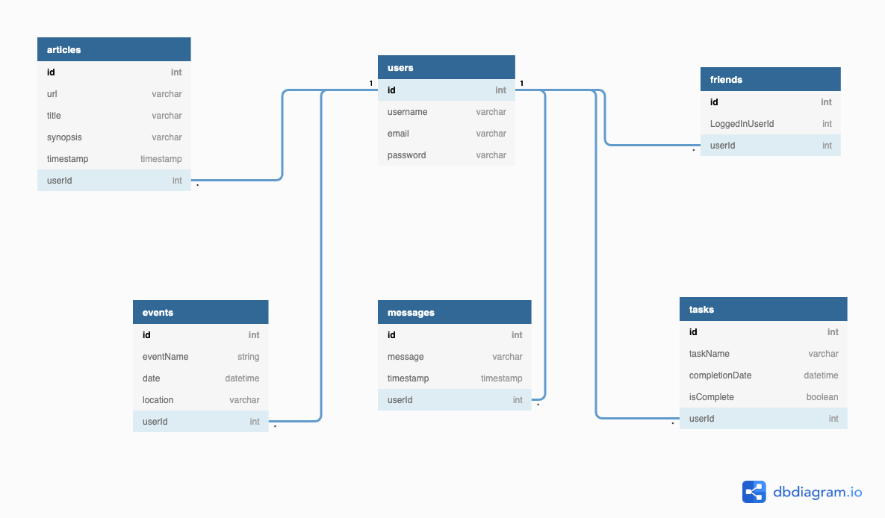

# Nutshell: The Information Dashboard

## Setup: Follow these steps to set up the app

1. Clone this repository
2. `cd` into the directory it creates
3. Make a `database.json` file in the `api` directory. Refer to ERD relationships below for data structure
4. Initiate the json server in port 8088 from the `api` directory.
    * `json-server -p 8088 -w database.json`
4. In a new terminal tab/window `cd` into the `src` directory
5. Run `hs -o .`

## ERD Relationships

## Using the App

Nutshell is a dashboard for people to use to organize their daily tasks, events, news article, friends, and chat messages.

### Messaging

### Events

### News Articles

A user can save news articles to their personal dashboard by clicking 'Add New Article' and inputting the appropriate information in the input fields. Saved articles are populated with the most recently saved/edited article first. Any article entry can be edited or deleted by clicking the 'edit' or 'delete' button below each saved article.

### Tasks

A user can save tasks to a to-do list by clicking "Add A New Task" and adding a description and an expected completion date to the respective forms that appear. Users have the ability to edit the name and date of tasks by clicking an "Edit" button located next to each task. They also can check a task as complete by clicking the "Done" checkbox. This will remove the task from their to-do list, but it will still persist in the database as a completed task. 
