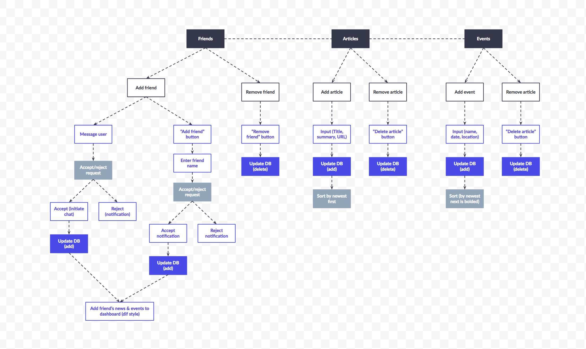

# Nutshell: The Information Dashboard

## Setup: Follow these steps to begin set-up

1. Clone this repository
2. `cd` into the directory it creates
3. Make a `database.json` file in the `api` directory
4. `cd` into the `src` directory
15. Run `hs -o .` to verify everything works

## Instructions

Nutshell is a new product offering that you have been tasked with building. It's a dashboard for people to use to organize their daily tasks, events, news article, friends, and chat messages.

You will be utilizing all of the skills and concepts that you've learned up to this point in the course.

1. Functions
1. Databases/API ([JSON Server Documentation](https://github.com/typicode/json-server))
1. Github
1. Objects
1. CSS/Flexbox
1. Array methods
1. Handling user events
1. Factory functions
1. Implementing CRUD operations
1. Modular code with Webpack
1. Relational data

To start you off, here's an example of what the resources in your API should look like once it's populated with some data from your application.

### Users

```json
    { 
    "id": 1, 
    "username": "Steve", 
    "email": "me@me.com" 
    }
```

### Messages

```json
    { 
    "id": 1, 
    "userId": 1, 
    "message": "What's up?" 
    }
```

### News

```json
    {
    "id": 1,
    "userId": 2,
    "url": "https://www.quantamagazine.org/newfound-wormhole-allows-information-to-escape-black-holes-20171023/",
    "title": "Wormholes Allow Information to Escape Black Holes",
    "synopsis": "Check out this recent discovery about workholes"
    }
```

### Friends

```json
    { 
    "id": 1, 
    "userId": 1, 
    "loggedInUserId": 3 
    }
```

### Tasks

```json
    { 
    "id": 1, 
    "userId": 3, 
    "task": "Take out garbage" 
    }
```

## ERD Relationships


## How to Handle Authentication

Be very clear that what you will be implemting is not real authentication. It is a simulation of it using very simplistic tools.

You will be using session storage to keep track of which user has logged into Nutshell. When the user fills out the registration form, you will POST their username and password to the `users` collection in your API. You will then immediately take the `id` of the object in the response and save it to session storage.

```js
sessionStorage.setItem("activeUser", user.id)
```

If you want to add a Logout feature, all you need to do it remove the session storage item.

```js
sessionStorage.removeItem("activeUser")
```

## Visual Feature List

To help you along, here is a visualization of a few features, as envisioned by one of your predecessors.



## Keep in mind some tips for a good usable app

1. Use acceptable conventions
   * Logo positioned at top left
   * Navigation across the top or down the left side
2. Visual hierarchy
   * Most important information is the most prominent
3. Break pages up into defined sections
   * Logically related content should be related visually
4. That which is clickable should be obviously clickable.
5. Eliminate distractions
   * Use only two typefaces
   * Limit color pallet (3 colors with black and white)
   * Use a grid
6. Support scanning (users don't read)
   * Use plenty of headings
   * Short paragraphs
   * Bulleted lists
7. Strive for consistency.